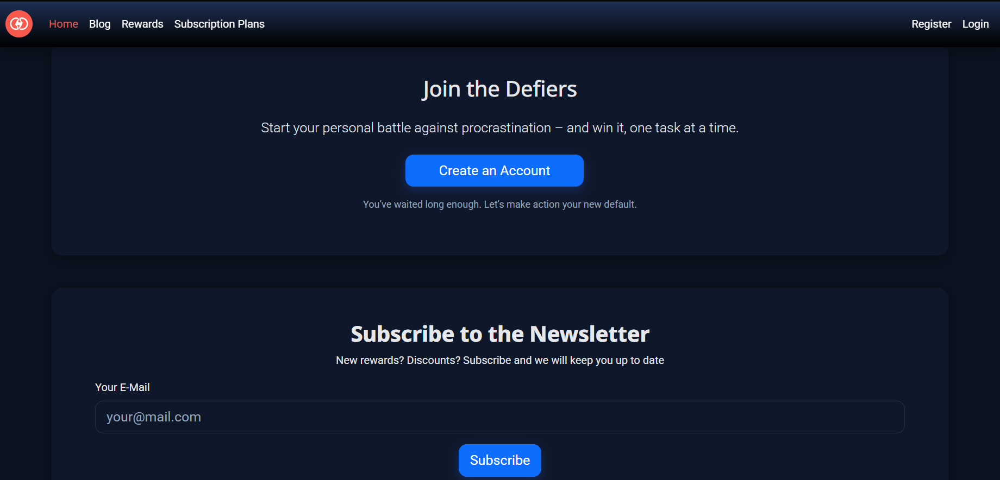
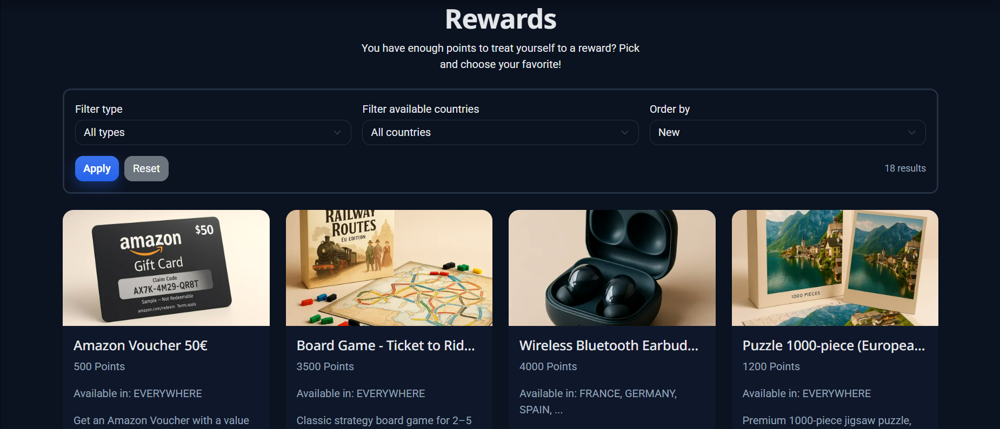
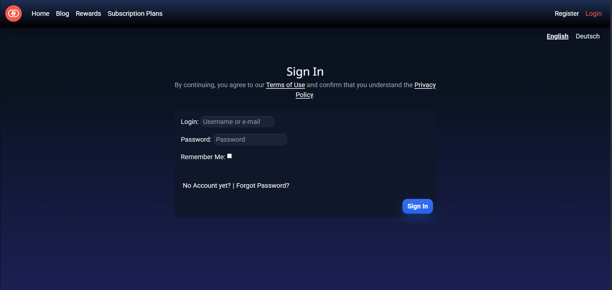
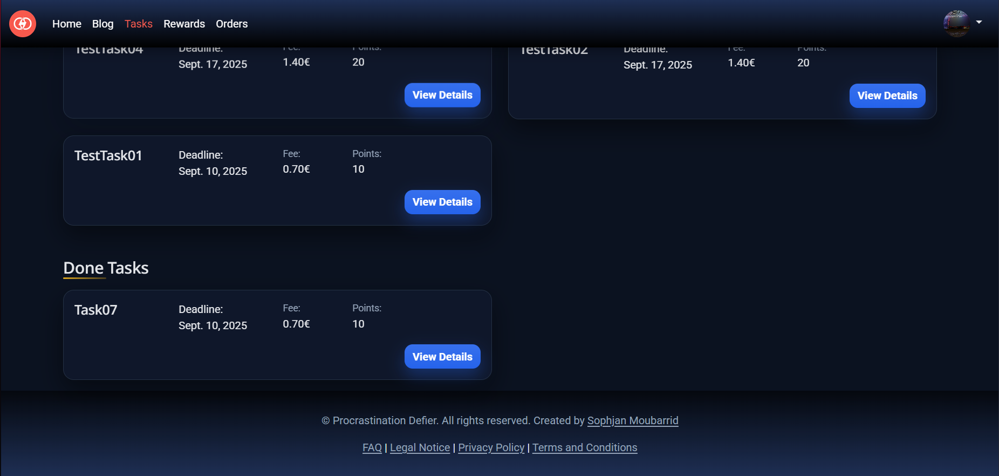
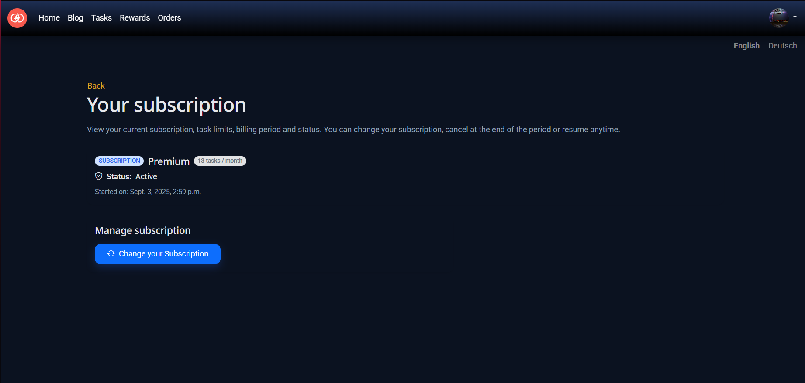
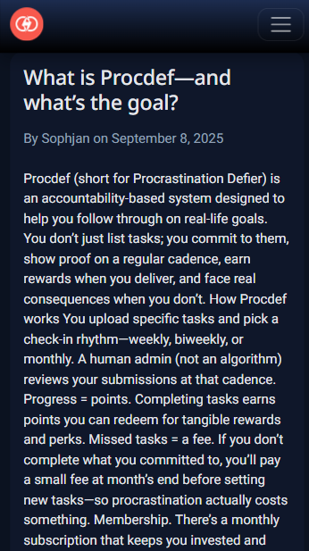

# Procrastination Defier

## Description

**Procrastination Defier** is a comprehensive task management and reward-based productivity web application. It helps users overcome Procrastination Defier by combining effective task management with a unique reward system. Users can create tasks, track their progress, and earn points for completing tasks. These points can then be redeemed for real rewards, creating a motivating cycle of productivity and achievement.

The application consists of several integrated components:
- Task Management System for organizing and tracking tasks
- Points System for rewarding completed tasks
- Rewards Marketplace where points can be redeemed
- Subscription System for premium features
- Blog Section for productivity tips and community engagement

## Live Version

You can access the live application here: [Procrastination Defier](https://procdef-live-28abebbb180a.herokuapp.com/de/)

To test the application, you can use these credentials:
Regular User
- Username: Tester1
- Password: Hallo123Hallo

Staff/Admin:
- Username: Menno
- Password: WerWieWarum123

If you create a new user and want to subscribe to Stripe, please use their test Credentials:

- Card information: 4242 4242 4242 4242
- Date: _Not important_
- CVC: _Not important_
- Name: _Not important_

  

### Application Screenshots

## **Homepage**

  

  

  

  

## **Blog**

  

  

## **Rewards**

  

  

  

## **Subscription**

  

## **Registration & Login**

  

  

## **Tasks**

  

  

  

  

  

  

## **Account**

  

  

  

  


## **Admin Perspective**

  

  

  

  

  

## Features

### Core Features

- **User Authentication & Profiles:**
  - Secure registration and login system

    

    

  - Password reset functionality

    


  - Profile customization

    


  - Default shipping address management
  
    

- **Task Management System:**
  - Create and delete tasks

    

  - Set due dates and priority levels and Add detailed task descriptions

    
  

- **Points & Rewards System:**
  - Earn points for completed tasks
  - Points vary based on task complexity
  - Track total points earned
  
    

    

    

    

- **Rewards Marketplace:**
  - Browse available rewards

    

  - Redeem points for rewards
  - View reward details and costs
  - Track order history
  - Shipping address management

    

    

- **CRUD System**: The rewards system has been designed with full CRUD capabilities for administrators. This means admins can create new rewards, update existing ones, delete outdated or incorrect entries, and review the current reward setup directly in the application. Its the only place where CRUD-functionality was implemented.


### Additional Features

- **Blog System:**
  - Read productivity tips
  - Community engagement
  - Share success stories
  - Comment on posts

    

    


- **User Support:**
  - FAQ section
  - Legal notices
  - Privacy policy
  - Terms and Conditions
  
  

  

  

  

### User Interface and Experience

Procrastination Defier features a modern, clean interface designed to minimize distractions and maximize productivity. The user interface is thoughtfully crafted to make task management and reward redemption intuitive and engaging for users of all experience levels.

#### Interface Components

- **Navigation System:**
  - Clean, intuitive navbar
  - Quick access to key features
  - Mobile-responsive menu

  **Desktop View**

  

  **On Mobile**

    

    

- **Dashboard Layout:**
  - At-a-glance task overview
  - Points balance display

  

#### User Experience Features

- **Interactive Feedback:**
  - Success messages for completed actions
  - Error notifications for failed submissions
  - Confirmation dialogs for important actions
    
    

    

    
  
- **Responsive Design:**
  - Seamless experience across devices
  - Touch-friendly interface
  - Adaptive layouts
  - Optimized for all screen sizes
  
  

  

  

  


#### User Flow Optimization

The application is designed to minimize friction and maximize user engagement through:

- **Streamlined Processes:**
  - One-click task completion
  - Quick reward redemption
  - Efficient navigation paths
  - Minimal form fields

- **Progressive Disclosure:**
  - Information presented in digestible chunks
  - Advanced features revealed as needed
  - Clear call-to-action buttons
  - Contextual help tooltips

- **Performance Focus:**
  - Fast page loads
  - Smooth transitions
  - Optimized image loading
  - Minimal server requests

## Development Process

### Planning & Design

The development of Procrastination Defier followed a structured approach focused on creating an effective productivity tool that combines task management with reward-based motivation. The planning phase involved extensive research into productivity psychology and reward systems to ensure the application would effectively help users overcome Procrastination Defier.

#### Key Planning Considerations

- **User Psychology:**
  - Understanding Procrastination Defier triggers
  - Implementing effective motivation techniques (Punishment and Reward)
  - Balancing challenge and reward
  - Creating sustainable habit-forming features

- **Technical Architecture:**
  - Scalable Django backend structure
  - Responsive frontend design
  - Secure payment integration
  - Real-time task updates
  - Efficient database design

- **Feature Prioritization:**
  - Core task management functionality
  - Points and rewards system
  - Subscription service integration
  - Blog and community features
  - User profile and preferences

- **Dropshiping Rewards**
  The Rewards that are displayed are not bought until the User redeems the reward.
  This way I stay cost efficient and keep the Stock flexible even if a Stock amount is set

### Agile Development Process

The project was developed using Agile methodology with two-week sprints. Each sprint focused on specific user stories and features:

| Issue ID | User Story | Priority |
|----------|------------|----------|
|[#1]| As a new user, I want to register an account, so that I can manage my tasks digitally. | High |
|[#2]| As a registered user, I want to log in with my email and password, so that I can access my tasks. | High |
|[#3]| As a registered user, I want to reset my password, so that I can regain access to my account if I forget my password. | Medium |
|[#4]| As a registered user, I want to be able to cancel my subscription. | High |
|[#5]| As a User, I want to be able to see the amount I have to pay for failed tasks. | High |
|[#6]| As a User, I want the payment to be automatically processed. | High |

### Task Management

| Issue ID | User Story | Priority |
|----------|------------|----------|
|[#7]| As a user, I want to add new tasks, so that I can build my habits. | Medium |
|[#8]| As a user, I want to mark a task as done, so that I don't have to pay the fee. | High |

### Rewards

| Issue ID | User Story | Priority |
|----------|------------|----------|
|[#9]| As a user, I want to be able to gather points for my task. | High |
|[#10]| As a user, I want to be able to buy rewards with my points. | Medium |
|[#11]| As a user, I want to easily sign up for a discount newsletter. | Low |

### Task Checkup

| Issue ID | User Story | Priority |
|----------|------------|----------|
|[#12]| As an employee, I want to be able to see the tasks I have to check. | High |
|[#13]| As an employee, I want to have a checkbox to mark a task as done. | Medium |

### UI & UX Enhancements

| Issue ID | User Story | Priority |
|----------|------------|----------|
|[#14]| As a user, I want a mobile-friendly interface, so that I can manage my tasks on my phone. | Medium |

### Privacy & Security

| Issue ID | User Story | Priority |
|----------|------------|----------|
|[#15]| As a user, I want my tasks to remain private, so that only I can access it. | High |

### Scaling & Deployment

| Issue ID | User Story | Priority |
|----------|------------|----------|
|[#16]| As a developer, I want the application to run on Heroku, so that it is always accessible online. | High |

### Community Connection

| Issue ID | User Story | Priority |
|----------|------------|----------|
|[#17]| As a user, I want to be able to share my struggle with other users. | Low |

### Wireframes

The initial design was conceptualized using Balsamiq wireframes, establishing the foundation for the user interface and experience:

- User Management Panel

  

- User Management Panel in detail view

  

- Admin Management Panel

  

- Admin Management Panel in detailed view

  

- Fee Overview

  

- Rewards

  

- Rewards in detail

  

### Facebook Business Page

A Facebook business page mockup was created to demonstrate the social media marketing strategy for Procrastination Defier. The page would serve as a key platform for community engagement and brand awareness.

#### Social Media Content Strategy

- **Daily Posts:**
  - Productivity tips and tricks
  - User success stories
  - Task completion celebrations
  - New reward announcements

- **Weekly Features:**
  - "Community Member Highlight"
  - Live Q&A sessions

- **Monthly Content:**
  - Platform updates and new features
  - Special reward promotions
  - Community milestone celebrations

  

The Facebook presence would focus on building an engaged community of users who support each other in their productivity journey while showcasing the platform's features and benefits.


### Flowchart

The database architecture and system flow of Procrastination Defier is designed to efficiently handle task management, user interactions, and reward processing. The flowchart illustrates the complex relationships between different components of the application.

#### Database Structure
The flowchart shows the following key models and their relationships:

- **User Model**
  - Core user authentication and profile data
  - Connected to Points, Tasks, and Orders
  - Manages subscription status

- **Task Management**
  - Tasks linked to individual users
  - Status tracking and completion verification
  - Points allocation system

- **Rewards System**
  - Reward catalog management
  - Points transaction tracking
  - Order processing and fulfillment

- **Subscription Handling**
  - Subscription levels and features
  - Payment processing integration
  - Access control management

The database design ensures efficient data retrieval and maintains data integrity through proper foreign key relationships and constraints. This structure supports the application's core features while allowing for scalability and future enhancements.


### Testing Strategy

The development process included comprehensive testing at multiple levels:

1. **Unit Testing**
   - Model methods
   - Form validation
   - View logic
   - Utility functions

2. **Integration Testing**
   - User flows
   - Payment processing
   - Points system
   - Reward redemption

3. **User Testing**
   - Interface usability
   - Mobile responsiveness
   - Feature accessibility
   - Performance metrics


## Business Model & Marketing Strategy

### E-Commerce Business Model Overview

**Procrastination Defier** operates on a B2C (Business-to-Consumer) model, focusing on helping individuals overcome Procrastination Defier through a reward-based task management system. The platform combines productivity tools with e-commerce elements, creating a unique motivational ecosystem.

#### Target Audience
- **Primary Users**: Social media-engaged individuals (18-35) struggling with Procrastination Defier
- **Platform Presence**: TikTok, Instagram, Reddit, with secondary focus on YouTube/Facebook
- **User Behavior**: Regular social media users seeking motivation and productivity solutions

#### Marketing Strategy

**1. Organic Social Media Marketing**
- Content focusing on Procrastination Defier solutions and success stories
- Platform-specific content strategy:
  - TikTok: Quick productivity hacks and reward unveilings
  - Instagram: User success stories and reward showcases
  - Reddit: Community engagement and productivity discussions

**2. Content Marketing**
- Regular blog posts about:
  - Productivity techniques
  - Success stories
  - Reward showcases
  - Community achievements
- Email newsletters with:
  - Productivity tips
  - Special reward offers
  - Community highlights

**3. Promotional Strategy**
- Regular reward discounts
- Special seasonal offers
- Email and social media announcement system
- Community-driven promotions

**Name Quality**

- At the moment there is consideration to change the name "Procrastination defier" to something more accessable like "Consistify", "Task Breaker" or "Action Flow".
The idea is to make the purpose of the website clearer through its name and to keep it simple so that it is easily recognizable.

#### Business Goals & Implementation

**Primary Objectives:**
1. Help users overcome procrastination
2. Build an engaged community
3. Generate regular, active users

**Strategy Implementation:**
1. Reward & Punishment System
   - Regular reward distribution
   - Success documentation
   - User testimonial sharing
   - Fee implementation

2. Community Building
   - Social media engagement
   - User success sharing
   - Community support system

#### SEO Strategy

**Key Search Terms:**
1. Primary Keywords:
   - Procrastination Defier
   - Lazy
   - Productivity help
2. Secondary Keywords:
   - Online community
   - Productivity solution
   - Task management help

#### Marketing Budget Allocation
- Focus on organic growth through user testimonials
- Primary investment in reward quality
- Minimal paid advertising
- Emphasis on community-generated content

This business model leverages user success stories and reward fulfillment as primary marketing tools, creating a self-sustaining cycle of user acquisition and engagement through demonstrated results and community building.

## Testing and Validation

### Manual Testing

Comprehensive manual testing was conducted across all features to ensure functionality and user experience:

| Page    | User Actions           | Expected Results | Y/N | Comments    |
|-------------|------------------------|------------------|------|-------------|
| Sign Up     |                        |                  |      |             |
| 1           | Click on Sign Up button | Redirection to Sign Up page | Y |          |
| 2           | Click on the Login link in the form | Redirection to Login page | Y |          |
| 3           | Enter valid email 2 times | Field will only accept email address format | Y |          |
| 4           | Enter valid password 2 times | Field will only accept password format | Y |          |
| 5           | Click on Sign Up button | asks user to confirm email page Sends address a confirmation request email | Y |          |
| 6           | Confirm email | Redirects user to blank Sign In page | Y |          |
| 7           | Sign In | Redirects user to blank In page | Y |          |
| 8           | Sign In with the same email/username and password | Takes user to schedule page with pop-up confirming successful sign in. Get started button now missing in main nav, replaced by Menu | Y |          |
| 9           | Click "Logout" button | Redirects user to home page | Y |          |
| 10          | Click browser back button | You are still logged out | Y |          |
| Log In      |                        |                  |      |             |
| 1           | Click on Log In button | Redirection to Log In page | Y |          |
| 2           | Click on the Sign Up link in the form | Redirection to Sign Up page | Y |          |
| 3           | Enter valid email | Field will only accept email address format | Y |          |
| 4           | Enter valid password | Field will only accept password format | Y |          |
| 5           | Click on Log In button | Redirects user to blank In page | Y |          |
| 6           | click logout button | Redirects user to home page | Y |          |
| 7           | Click browser back button | You are still logged out | Y |          |
| 8           | Click on Log In button | Redirection to Log In page | Y |          |
| 9           | Enter valid email | Field will only accept email address format | Y |          |
| 10          | Enter valid password | Field will only accept password format | Y |          |
| 11          | Click Remember Me checkbox | Remembers user | Y |          |
| 12          | Click on Log In button | Redirects user to blank In page | Y |          |
| 13          | Click logout button | Redirects user to home page | Y |          |
| 14          | Click browser back button | You are still logged out | Y |          |
| 15          | Click on Log In button | Redirection to Log In page prefilled | Y |          |
| Navigation  |                        |                  |      |             |
| 1           | Click on the logo | Redirection to home page | Y |          |
| 2           | Click Blog | Redirection to Blog page | Y |          |
| 3           | Click Tasks button | Redirection to Tasks page | Y |          |
| 4           | Click Rewards button | Redirection to Rewards page | Y |          |
| 5           | Click Orders button | Redirection to Orders page | Y |          |
| 6           | Click Profile Picture | Open Dropdown Menu page | Y |          |
| 7           | Click Logout button | Redirection to Logout page | Y |          |
| 8           | Click either "English" or "Deutsch" | Switch language to selected Lanaguage | Y |          |
| Admin Navigation |                        |                  |      |             |
| 1           | Click on the logo | Redirection to home page | Y |          |
| 2           | Click Blog | Redirection to Blog page | Y |          |
| 3           | Click Tasks button | Redirection to Tasks page | Y |          |
| 4           | Click Rewards button | Redirection to Rewards page | Y |          |
| 5           | Click Orders button | Redirection to Orders page | Y |          |
| 6           | Click Profile Picture | Open Dropdown Menu page | Y |          |
| 7           | Click Logout button | Redirection to Logout page | Y |          |
| 8           | Click on Add Rewards attributes | Redirection to add rewards Form | Y |          |
| Store |                        |                  |      |             |         |
| 1  | Select a Type | Coresponding types are displayed | Y |          |
| 2  | Select a country | Coresponding countries are displayed | Y |          |
| 3  | Select a order type | Products are sorted by selected filter | Y |          |
| 4 | Click on Reset Button | Selected filters are removed | Y | |
| 5 | Click on See Details Button | Selected Reward opens | Y | |
| Product Details |                        |                  |      |             |
| 1 | Click Back To Rewards Button | Go back to rewards overview | Y |
| 2 | Click on Redeem Reward | Opens Order Form | Y | |
| Profile |                        |                  |      |             |
| 1 | Click on the edit profile button | User will be redirected to the edit profile page | Y | |
| 3 | Click on the manage subscription button | User will be redirected to the manage subscription page | Y |  |
| 4 | Click on Change Password button | User will be redirected to change password Site | Y | |
| Edit Profile Data |                        |                  |      |             |
| 1 | Type in the first name | First name is changed | Y | |
| 2 | Type in the last name | Last name is changed | Y | |
| 3 | Type in Email | Email is changed | Y | |
| 4 | Upload Image | Profile Picture is changed | Y | |
| 5 | Click Save changes button | Changes will be confirmed and the user will see a message to notify them | Y | |
| Edit Password |                        |                  |      |             |
| 1 | Type in the old password | Old password is changed | Y | |
| 2 | Type in the new password | New password is changed | Y | |
| 3 | Type in the new password confirmation | New password confirmation is changed | Y | |
| 4 | Click Save changes button | Changes will be confirmed and the user will see a message to notify them | Y | |
| My Order Details |                        |                  |      |             |
| 1 | Click on the Back to my orders button | User will be redirected to the My Orders page | Y | |
| Tasks |                        |                  |      |             |
| 1 | Click on Add Task button | Opens task creation form | Y | |
| 2 | Fill in task title | Title is accepted | Y | |
| 3 | Set due date | Calendar opens and date can be selected | Y | |
| 4 | Select priority level | Dropdown shows all priority options | Y | |
| 5 | Add task description | Description is accepted | Y | |
| 6 | Click Save Task button | Task is created and shows in task list | Y | |
| 7 | Click on existing task | Opens task detail view | Y | |
| 8 | Click Mark as Done button | Task status changes to completed | Y | |
| 9 | Click Delete Task button | Confirmation modal appears | Y | |
| 10 | Confirm task deletion | Task is removed from list | Y | |
| Blog |                        |                  |      |             |
| 1 | Click on Blog post | Opens post detail view | Y | |
| 2 | Click comment button | Opens comment form if logged in | Y | |
| 3 | Submit comment | Comment appears under post | Y | |
| 4 | Click edit own comment | Opens edit comment form | Y | |
| 5 | Click delete own comment | Confirmation modal appears | Y | |
| Rewards Marketplace |                        |                  |      |             |
| 1 | Apply price filter | Shows rewards in selected range | Y | |
| 2 | Apply category filter | Shows rewards from selected category | Y | |
| 3 | Click on reward | Opens reward detail view | Y | |
| 4 | Click Redeem button | Opens redemption confirmation | Y | |
| 5 | Confirm redemption | Points are deducted and order created | Y | |
| Subscription |                        |                  |      |             |
| 1 | Click Subscribe button | Opens subscription options | Y | |
| 2 | Select subscription plan | Shows plan details | Y | |
| 3 | Enter payment details | Form accepts card information | Y | |
| 4 | Submit subscription | Processes payment and activates subscription | Y | |
| 5 | Cancel subscription | Shows confirmation and cancels plan | Y | |
| Settings & Preferences |                        |                  |      |             |
| 1 | Change language | Updates UI language | Y | |
| 2 | Change notification settings | Updates notification preferences | Y | |
| 3 | Update profile picture | Uploads and displays new image | Y | |
| 4 | Change password | Updates password after verification | Y | |
| 5 | Update email | Sends verification to new email | Y | |
| Points System |                        |                  |      |             |
| 1 | Complete task | Points are awarded | Y | |
| 2 | View points history | Shows all point transactions | Y | |
| 3 | Redeem points | Points balance updates correctly | Y | |
| 4 | Points expiration | Points expire after set time | Y | |
| 5 | Bonus points | Special events award correct points | Y | |

#### Browser Testing

The application was tested across multiple browsers and devices:

| Browser | Version | Status |
|---------|---------|--------|
| Chrome | Latest | ✅ Full Functionality |
| Firefox | Latest | ✅ Full Functionality |
| Opera GX | Latest | ✅ Full Functionality |

#### Security Testing

Security measures were thoroughly tested:

- CSRF protection verification
- XSS vulnerability scanning
- SQL injection testing
- Authentication security
- Session management
- Data encryption
- Input validation
- Error handling

#### Responsive Design Testing
The application was thoroughly tested across different devices and screen sizes:

  

  

  

  


## Code Validation

### HTML Validation
All HTML templates were validated using the [W3C Markup Validation Service](https://validator.w3.org/). Due to Django template syntax i opend the source code and copied it directly into the validator:

| Page | Result | Notes |
|------|--------|-------|
| Homepage | ✅ Pass | No errors |
| Task Dashboard | ✅ Pass | No errors |
| Task Creation | ✅ Pass | No errors |
| Rewards Marketplace | ✅ Pass | No errors |
| Order History | ✅ Pass | No errors |
| Profile Page | ✅ Pass | No errors |
| Subscription Plans | ✅ Pass | No errors |
| Blog Overview | ✅ Pass | No errors |

Example validation results:


### CSS Validation
CSS was validated using the [W3C CSS Validation Service](https://jigsaw.w3.org/css-validator/):

| File | Result | Notes |
|------|--------|-------|
| base.css | ✅ Pass | No errors |
| home.css | ✅ Pass | No errors |
| input_form.css | ✅ Pass | No errors |

Example validation results:


Remarks to input_form.css:
 - color-mix() is a new function of CSS4 and therefore the validator throws an error
 - ::file-selector-text is no official pseudo-element and therefore the validator throws an error
  


### JavaScript Validation
JavaScript file were validated using [JSHint](https://jshint.com/):

| File | Result | Notes |
|------|--------|-------|
| timer.js | ✅ Pass | No major issues |

Example JSHint results:


### Python Validation
I validated the code with Code Institutes [Python Linter](https://pep8ci.herokuapp.com):

| App | Result | Notes |
|-----|--------|-------|
| blog_post/views.py | ✅ Pass | No issues |
| checkout/views.py | ✅ Pass | No issues |
| profiles/views.py | ✅ Pass | No issues |
| rewards/views.py | ✅ Pass | No issues |
| subscription/views.py | ✅ Pass | No issues |
| tasks/views.py | ✅ Pass | No issues |
| blog_post/models.py | ✅ Pass | No issues |
| checkout/models.py | ✅ Pass | No issues |
| profiles/models.py | ✅ Pass | No issues |
| rewards/models.py | ✅ Pass | No issues |
| subscription/models.py | ✅ Pass | No issues |
| tasks/models.py | ✅ Pass | No issues |
| blog_post/forms.py | ✅ Pass | No issues |
| checkout/forms.py | ✅ Pass | No issues |
| profiles/forms.py | ✅ Pass | No issues |
| rewards/forms.py | ✅ Pass | No issues |
| tasks/forms.py | ✅ Pass | No issues |
| profiles/context_processors.py | ✅ Pass | No issues |
| subscription/context_processors.py | ✅ Pass | No issues |

Example validation results:

**Views**
- Blog Post
  

- Checkout
  

- Profile
  

- Rewards
  

- Subscription
  

- Tasks
  

**Models**
- Blog Post
  

- Checkout
  

- Profile
  

- Rewards
  

- Subscription
  

- Tasks
  


**Forms**
- Blog Post
  

- Checkout
  

- Profile
  

- Rewards
  

**Context Processors**
- Blog Post
  

- Subscription
  


### Performance Testing
Lighthouse scores for key pages:

| Page | Performance | Accessibility | Best Practices | SEO |
|------|------------|---------------|----------------|-----|
| Homepage | 98 | 98 | 100 | 100 |
| Blog | 92 | 98 | 94 | 96 |
| Blog Post | 94 | 99 | 96 | 97 |
| Rewards | 94 | 99 | 96 | 97 |
| Reward Details | 94 | 99 | 96 | 97 |
| Subscription Plans | 94 | 99 | 96 | 97 |

Example Lighthouse report:


### Development Tools

- **Languages Used**:
  - **Python**: Primary backend language using Django framework
  - **JavaScript**: Frontend interactivity and AJAX calls
  - **HTML5**: Structure and content markup
  - **CSS3**: Styling and responsive design

- **Frameworks and Libraries**:
  - **Django**: Main web framework
  - **Bootstrap 5**: Frontend framework for responsive design
  - **jQuery**: JavaScript library for DOM manipulation
  - **Stripe.js**: Payment processing integration
  - **Crispy Forms**: Form rendering and handling

- **VS Code**: Primary IDE with following extensions:
  - Python
  - Django
  - JavaScript
  - ESLint
  - Prettier
  - **Git**: Version control system
  - **GitHub**: Repository hosting and project management
  - **Chrome DevTools**: Frontend debugging and responsive design testing
  - **PgAdmin**: PostgreSQL database management

- **Validation and Testing**:
  - **CI Python Linter**: Python code validation
  - **JSHint**: JavaScript validation
  - **W3C Validator**: HTML and CSS validation
  - **Chrome Lighthouse**: Performance and accessibility testing

- **Design Tools**:
  - **Balsamiq**: Wireframe creation
  - **Figma**: UI/UX design
  - **Coolors**: Color scheme generation
  - **Font Awesome**: Icons
  - **Google Fonts**: Typography

- **Deployment and Hosting**:
  - **Heroku**: Application hosting
  - **Cloudinary**: Media file storage
  - **ElephantSQL**: PostgreSQL database hosting
  - **WhiteNoise**: Static file serving

- **Project Management**:
  - **GitHub Projects**: Agile project management
  - **GitHub Issues**: User story and bug tracking
  - **GitHub Wiki**: Documentation

### Technologies Used

The application is built using modern web technologies and follows industry best practices:

#### Backend Stack
- **Python 3.9+**: Core programming language
- **Django 4.2**: Web framework
  - django-allauth: Authentication
  - django-crispy-forms: Form handling
  - django-storages: File storage
- **PostgreSQL**: Database system
- **Gunicorn**: WSGI HTTP Server
- **Cloudinary**: Media management
- **Stripe**: Payment processing

#### Frontend Stack
- **HTML5**: Semantic markup
- **CSS3**: Custom styling with features:
  - Flexbox
  - Grid
  - Custom Properties
  - Media Queries
- **Bootstrap 5**: Responsive design framework

#### Development Environment
- **VS Code**: Primary IDE
- **Git**: Version control
- **GitHub**: Repository hosting
- **pip**: Python package management

#### Testing Tools
- **Django TestCase**: Unit testing
- **Coverage.py**: Code coverage
- **Jest**: JavaScript testing
- **Chrome DevTools**: Browser debugging

#### Deployment Tools
- **Heroku CLI**: Deployment management
- **WhiteNoise**: Static file serving
- **Gunicorn**: Production server

## Setup & Installation

### Prerequisites

To run Procrastination defier locally, ensure you have:

- **Python 3.x** installed on your machine. You can download it from [python.org](https://www.python.org/downloads/).
- **Git** installed to clone the repository. Download it from [git-scm.com](https://git-scm.com/).

### Installation

1. **Clone the repository**  
   Open a terminal and run:
   ```sh
   git clone https://github.com/fairytaib/procrastination-defier
   ```
2. **Navigate to the folder**
   ```Sh
   cd procrastination-defier
   ```
3. **Create and activate a virtual environment**

   This ensures that all dependencies are installed in an isolated environment and do not clutter your global Python installation.

- On Windows
  ```sh
  python -m venv venv
  venv\Scripts\activate
  ```
- On macOS/Linux:
  ```sh
  python -m venv venv
  venv\Scripts\activate
  ```

4. **Install dependencies**

   Instead of installing libraries manually, install all required dependencies from the requirements.txt file:

   ```sh
   pip install -r requirements.txt
   ```

5. **Run the website**

Open your terminal and run the command:

```sh
py manage.py runserver
```

#### Deactivating the Virtual Environment

Once you are done, you can deactivate the virtual environment by typing CTRL + C

### Deployment

To deploy Procdef on **Heroku** using their web interface, follow these steps:

#### 1. Create a Heroku Account

- Go to [Heroku](https://www.heroku.com/) and sign up for a free account if you don’t have one.

  

#### 2. Create a New Heroku App

- Log in to your Heroku dashboard.
- Click **"New" → "Create new app"**.
- Enter a unique app name and choose a region (e.g., Europe or United States).
- Click **"Create app"**.
  
  

#### 3. Connect to GitHub

- In the **"Deploy"** tab, find the **"Deployment method"** section.
- Select **GitHub** and click **"Connect to GitHub"**.
- Search for your Hangman repository and connect it.

  

#### 4. Configure Buildpacks

- In the **"Settings"** tab, scroll down to **"Buildpacks"** and click **"Add buildpack"**.
- Add **Python** and **NodeJs** as a buildpack.

  

- Scroll down to **"Config Vars"** and following Keys and their corresponding values.

  

- Add other needed **Config Vars** for your databases etc.

#### 5. Deploy the Application

- Go back to the **"Deploy"** tab.
- Under **"Manual deploy"**, choose the branch (usually `main` or `master`).
- Click **"Deploy Branch"** to start the deployment.
- Wait for the build process to complete. If successful, Heroku will provide a link to your live app.

#### 6. Enable Automatic Deployments (Optional)

- In the **"Automatic deploys"** section, click **"Enable Automatic Deploys"** to deploy new changes automatically when you push updates to GitHub.

#### 7. Run the App

- Click **"Open app"** in the top-right corner of the Heroku dashboard to view your deployed project.

## Bugs Encountered, Solutions, and General Observations

### Bugs and Problems encountered

- **Stripe Functionality**: It took me some time to fully understand how to connect Stripe properly. There was an initial approach to create an account after the user subscribed and fetch the entered email-adress form stripe but this proved difficult. A Person signing up could insert an already existing email-adress and log in into already existing accounts with no validation whatsoever. Therefore i had to change it.

- **Phishing Alert**: It happend a few times that my live version were confused by the browser as a phishing attack. This happend because i referenced wrong config vars without realising. It was very difficult to find the problem initialy but after i knew the reason it was managable.

- **Mailchimp Subscription**: With the new Mailchimp interface, there was no confirmation on the website for successful newsletter sign-ups. Users were redirected to a success landing page with a button labelled ‘Continue to website’. In my case, this ‘Continue to website’ button did not work and I received a Mailchimp 404 page. Therefore, after signing up, I had to redirect users to my own newsletter confirmation page.

- **Stripe Integration**: The decision to not use a blank page after Stripe payment was intentional for user experience. Redirecting users back to the application after subscription provides a more seamless flow, and users can easily return using Stripe's built-in back button if needed. This approach reduces user confusion and maintains consistency in the navigation flow.

- **Post-Login Redirect Behavior**: The current setup redirects all users to the subscription page after login. While this flow is intentional and makes sense for regular users, it is not ideal for admins, as their primary focus lies elsewhere. At this point, no solution has been found to implement role-based redirects, which would allow different landing pages depending on whether the logged-in user is an admin or a regular user.

## Future Plans

 - **Renaming Project**: Currently the initialy name is too difficult for the average user and Non-native speakers. In further updates this is supposed to be changed in an intuitive way like "Consistify", "Task Breaker" or "Action Flow" 

 - **"Best Buddy" Subscription**: In future updates i will implement a subscription where two user can check the tasks of each other in case they dont want an admin to check. This will be useful for customers who work with sensitive data (like invoices or Company information) or extremly specialized content (like doctoral theses scientific content in general) 

 - **HTMX / React**: For a better User experience it is planned to switch to HTMX or React. This feature will create a more modern and userfriendly website

 - **Cooperations**: I will search for Cooperation Partners who will work with me. This could be sponsored rewards, customized rewards or discounts when i buy/sell products from their brand

 - **Access to premium rewards**: Premium subscribers will enjoy exclusive access to a curated selection of high-value rewards not available in the standard marketplace, including limited edition items, higher value gift cards, and early access to new releases.

 ## Credits

**Creative Content**

- **ChatGpt**: Creating Images and Logos
- **Miro**: [Miro](https://miro.com/de/) was my tool to create and visualize my pseudo-code
- **Wireframe**: My Page layout was created with the tool [Balsamiq](https://balsamiq.com/)

**Content and Tutorials**

- **Stack Overflow**: All kinds of different questions and anwsers from [Stack Overflow](https://stackoverflow.com/).

- **Youtube Tutorials**: There were several Videos i watched including:
  - [Stripe Subscriptions & Billing Plans - Recurring Payments with Stripe Subscription Tutorial](https://www.youtube.com/watch?v=T3b8ijT27f4&pp=ygUcc3RyaXBlIHN1YnNjcmlwdGlvbiB0dXRvcmlhbA%3D%3D)

  - [Implement Stripe Subscriptions](https://www.youtube.com/watch?v=tyK93t0hWXg&pp=ygUcc3RyaXBlIHN1YnNjcmlwdGlvbiB0dXRvcmlhbNgGJ9IHCQmyCQGHKiGM7w%3D%3D)
  
  - [Subscriptions with Stripe and Django - Part 7](https://www.youtube.com/watch?v=i7UYf4erY84&pp=ygUcc3RyaXBlIHN1YnNjcmlwdGlvbiB0dXRvcmlhbNgGkwU%3D)

and many more.

**Libraries**

The following libraries and packages were used in this project (as listed in `requirements.txt`):

- **asgiref**: ASGI specification implementation for Python web frameworks
- **boto3**: AWS SDK for Python to interact with AWS services
- **botocore**: Low-level interface to AWS operations
- **certifi**: Provides Mozilla's CA Bundle for Python requests
- **cffi**: Foreign Function Interface for Python calling C code
- **charset-normalizer**: Library for character set detection
- **cloudinary**: Cloud service for image and video management
- **crispy-bootstrap5**: Bootstrap5 template pack for django-crispy-forms
- **cryptography**: Cryptographic recipes and primitives for Python
- **defusedxml**: XML bomb protection for Python stdlib modules
- **dj-database-url**: Database URL configuration for Django
- **dj3-cloudinary-storage**: Cloudinary storage backend for Django
- **Django**: High-level Python web framework
- **django-allauth**: Authentication, registration & account management
- **django-countries**: Country choices for Django models and forms
- **django-crispy-forms**: Control rendering behavior of Django forms
- **django-multiselectfield**: Multiple select field for Django
- **django-storages**: Collection of custom storage backends for Django
- **gunicorn**: Python WSGI HTTP Server for UNIX
- **idna**: Internationalized Domain Names in Applications (IDNA)
- **jmespath**: JSON Matching Expressions
- **oauthlib**: OAuth request-signing logic implementation
- **Pillow**: Python Imaging Library
- **psycopg2-binary**: PostgreSQL adapter for Python
- **pycparser**: Parser for the C language
- **PyJWT**: JSON Web Token implementation in Python
- **python-dotenv**: Read key-value pairs from .env file
- **python3-openid**: OpenID support for servers and consumers
- **requests**: HTTP library for Python
- **requests-oauthlib**: OAuthlib authentication support for Requests
- **s3transfer**: Amazon S3 Transfer Manager
- **sqlparse**: Non-validating SQL parser for Python
- **stripe**: Library for Stripe's API
- **typing_extensions**: Backported and experimental type hints
- **urllib3**: HTTP client for Python
- **whitenoise**: Static file serving for Python web apps

**Mentoring and Guidance**

- **Iuliia Konovalova**: Mentoring and guidance by [Iuliia Konovalova](https://github.com/IuliiaKonovalova).


- **Code Institute & Code Institute Student Support**: Teaching me the needed skills and the knowledge to work on this project. 

